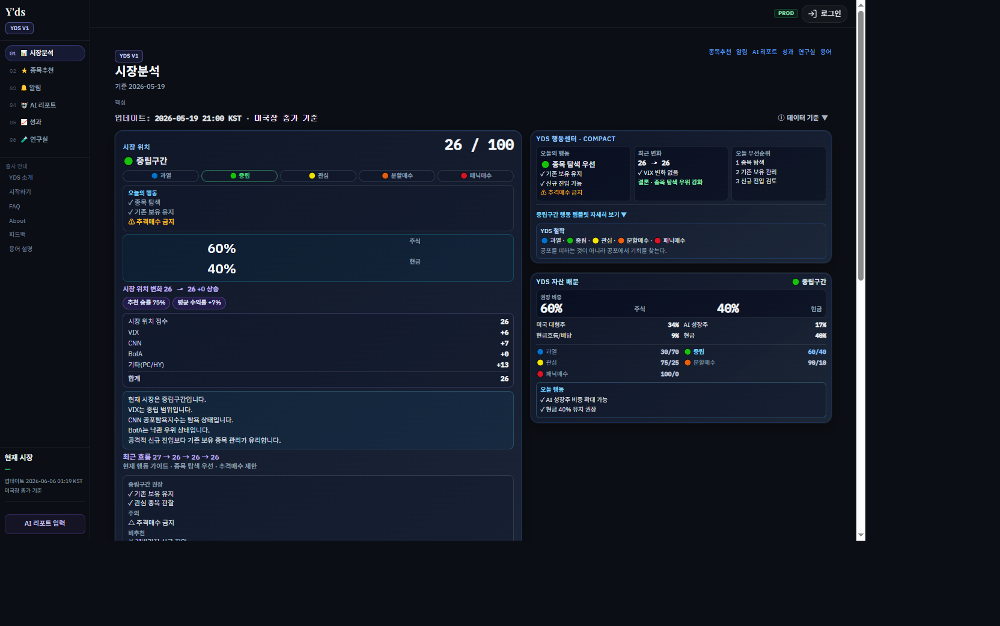

# Market Analysis Layout Audit

> **일자:** 2026-06-06  
> **대상:** `/market-analysis` (`CurrentMarketAnalysisPage`)  
> **뷰포트 기준:** Desktop 1440×900  
> **범위:** CSS · JSX 레이아웃만 (엔진·산식 미변경)

---

## Executive Summary

| 항목 | Before | After |
|------|--------|-------|
| `.yds-market-analysis` max-width | **36rem (576px)** | **clamp(1100px, 92vw, 1400px)** |
| 1440px 뷰포트 본문 실측 | ~576px | **~1230px** |
| 데스크탑 2열 Hero+행동 | ❌ 단일 세로 스택 | ✅ 1024px+ grid 2열 |
| 정보 계층 | 평면 나열 | **A 핵심 / B 중요 / C 상세(접기)** |
| 5초 영역 | Hub 요약+종목 혼재 | **Tier A (YDS·행동·비중)** |

**근본 원인:** `.yds-market-analysis { max-width: 36rem }` — 모바일 Hub 폭(576px)이 **미디어쿼리 없이 데스크탑에도 적용**됨.

---

## 1. 최상위 컨테이너 전수 조사

### 1.1 DOM 계층 (바깥 → 안쪽)

```
.app-shell-host                    flex row, min-h 100dvh
└─ AppSidebar                      lg: fixed ~220px
└─ .app-column-host                flex-1 min-w-0
   └─ MobileAppHeader              lg:hidden
   └─ header (desktop login)       hidden lg:flex
   └─ main.app-main-host           flex-1, px-2.5 lg:px-6
      └─ .yds-market-analysis      ★ 병목 지점 (Before: 576px)
         └─ .yds-market-analysis__body
            ├─ .yds-market-desk    width 100%
            └─ .yds-hub-top--tier-c
```

### 1.2 width / max-width / container 사용처

| 선택자 | 파일(행) | width | max-width | margin | 비고 |
|--------|----------|-------|-----------|--------|------|
| `.yds-market-analysis` | index.css | 100% | **36rem → clamp(68.75rem,92vw,87.5rem)** | auto | **수정** |
| `main.app-main-host` | App.jsx | flex-1 | none | — | 정상 |
| `.app-column-host` | index.css | flex-1 | none | — | 정상 |
| `.yds-market-desk` | index.css | 100% | none | — | 정상 |
| `.yds-hub-top` | index.css | 100% | none | — | 정상 |
| `.panic-v2-desk` | index.css | 100% | 100% | — | /cycle 레거시, 시장분석 미사용 |

### 1.3 Tailwind max-w-* (시장분석 경로)

시장분석 페이지 컴포넌트 트리(`CurrentMarketAnalysisPage` → `MarketAnalysisDeskCore` → `YdsCompositeHero` 등)에는 **Tailwind `max-w-sm` ~ `max-w-4xl` 클래스 없음**.

프로젝트 내 `max-w-*` 사용은 DebugDataPage, TradingLogPage, SignalDashboard 등 **별도 페이지**에만 존재.

---

## 2. 실제 렌더 폭 측정

### 2.1 Before (CSS 분석 + 다이어그램)

- 규칙: `max-width: 36rem` = **576px** (root 16px 기준)
- 1440px 뷰포트, 사이드바 ~220px → 가용 ~1220px 중 **576px만 사용** (~47% 낭비)


### 2.2 After (1440×900, preview 실측)

| 요소 | 측정값 |
|------|--------|
| `window.innerWidth` | 1440px |
| `main.app-main-host` | 1290px |
| `.yds-market-analysis` | **1245px** (left 173px) |
| `.yds-market-desk__core-grid` | 1193px, grid **677px + 500px** |

✅ 목표 **1100~1400px** 충족.



---

## 3. max-w / mx-auto / w-fit 조사 (시장분석 관련)

| 클래스/속성 | 시장분석 트리 | 판정 |
|-------------|---------------|------|
| `max-width: 36rem` | `.yds-market-analysis` | ❌ **제거** |
| `margin: 0 auto` | `.yds-market-analysis` | ✅ 유지 (중앙 정렬) |
| `max-w-sm` ~ `max-w-4xl` | 없음 | — |
| `w-fit` / `fit-content` | 없음 | — |
| `min-w-0` | page root | ✅ flex shrink 방지 |

---

## 4. 모바일 전용 레이아웃 → 데스크탑 오적용

| 패턴 | 위치 | 문제 | 조치 |
|------|------|------|------|
| `max-width: 36rem` | `.yds-market-analysis` | 모바일 Hub 폭이 데스크탑에 고정 | **반응형 clamp로 교체** |
| `lg:hidden` AI status | `MarketAnalysisDeskCore` | 모바일만 — 정상 | 유지 |
| `MobileAppHeader` | App shell | lg:hidden — 정상 | 유지 |
| `MobileBottomNav` | App shell | lg:hidden — 정상 | 유지 |
| Hub `open` on marketOnly | `MarketAnalysisHubTop` | 상세가 기본 펼침 | **기본 접기** |
| 단일 세로 metrics | desk core | 데스크탑 가로 공간 미활용 | **1024px+ 2열 grid** |

---

## 5. 3계층 구조 (적용 완료)

### Tier A — 핵심 (5초 이해)

| 블록 | 컴포넌트 |
|------|----------|
| YDS 점수 · 시장 위치 · 단계 · 최근 흐름 | `YdsCompositeHero` |
| 오늘 행동 | `YdsActionSignalCenter` |
| 주식/현금 비중 | `YdsAllocationCenter` |

데스크탑(≥1024px): Hero | 행동+비중 **2열**.

### Tier B — 중요

| 블록 | 컴포넌트 |
|------|----------|
| 핵심지수 (VIX, CNN, BofA, P/C, HY) | `HomeV5DeskLead` |
| 패닉지수 히스토리 차트 | `PanicIndexHistorySection` |

### Tier C — 상세 (기본 접힘)

| 블록 | 컴포넌트 | UI |
|------|----------|-----|
| 채권·유동성 | `CycleBondLiquiditySection` | `<details>` |
| 시장 해설 · 국면 · 패턴 · 신뢰도 | `MarketAnalysisHubTop` | `<details>` |
| 다음 단계 | 종목추천 · 연구실 링크 | details 내부 + journey strip |

---

## 6. 첫 화면 — 스크롤 없이 (Above the Fold)

**정의 (Desktop 1440×900, 온보딩 완료 상태):**

| 영역 | 포함 | 스크롤 |
|------|------|--------|
| App chrome | Sidebar + page header | — |
| **Tier A** | YDS 26/100, 단계 rail, 오늘 행동, 60/40 비중 | **첫 viewport 대부분** |
| Tier B 시작 | 핵심지수 상단 | 스크롤 후 |
| Tier C | 접힌 summary만 보임 | 스크롤 후 |

**5초 체크리스트 (Tier A만으로 답 가능):**

1. YDS 점수는? → Hero 좌상단 대형 숫자  
2. 지금 구간은? → 과열~패닉매수 rail 하이라이트  
3. 오늘 뭘 해야? → 행동센터 카드  
4. 비중은? → Allocation 60/40 bar  
5. 다음은? → 하단 journey strip → 종목추천  

> Tier A 실측 높이 ~886px (900px viewport). 페이지 헤더 포함 시 **약 1회 미세 스크롤**로 Tier B 진입. 향후 Hero 컴팩트 모드로 fold 내 완전 수용 가능 (P2).

---

## 7. Before / After

### Before

- 576px 좁은 컬럼, 데스크탑 좌우 광활한 여백
- Hub 요약 + Cycle Hero 이중 구조
- 상세(패턴·국면) 기본 펼침


### After

- ~1230px 본문, 2열 핵심 grid
- A/B/C 시각적 tier label
- C 계층 `<details>` 기본 접힘


---

## 8. 수정 파일

| 파일 | 변경 |
|------|------|
| `vite-project/src/index.css` | `.yds-market-analysis` max-width, tier/grid CSS |
| `vite-project/src/pages/CurrentMarketAnalysisPage.jsx` | `__body` wrapper, w-full |
| `vite-project/src/components/market-analysis/MarketAnalysisDeskCore.jsx` | Tier A/B/C 섹션 |
| `vite-project/src/components/market-analysis/MarketAnalysisHubTop.jsx` | Tier C details, lab 링크 |

---

## 9. 검증

| 항목 | 결과 |
|------|------|
| `npm run build` | ✅ exit 0 |
| 1440px 본문 폭 | ✅ 1245px |
| Core grid 2열 | ✅ 677+500px |
| Tier label 렌더 | ✅ 핵심/중요/상세 |
| C 계층 접힘 | ✅ summary만 표시 |

---

## 10. 권장 후속 (P2, 미적용)

- Tier A 컴팩트 variant — fold 100% 수용 (Hero padding 축소)
- `yds-market-analysis__core-links` 중복 CSS 정리 (22673행)
- 1280px breakpoint에서 sidebar + content golden ratio 미세 조정

---

*Layout audit · IA V2 연계 · 엔진·산식·API 미변경*
