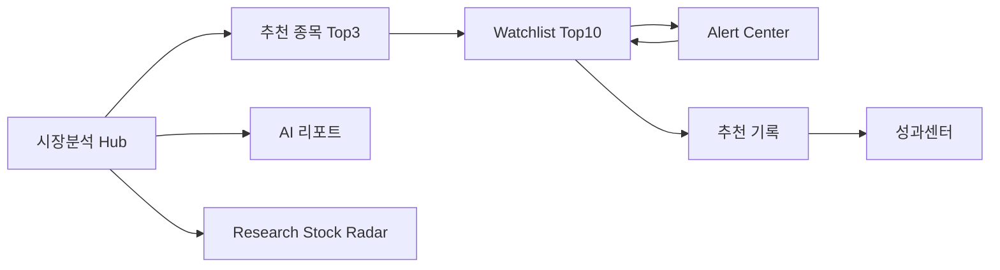

# YDS Recommendation Journey Audit

> 점검일: V1 Polish Sprint · UX only · 엔진 미변경

## 추천 흐름 지도

| 단계 | 경로 | 주요 CTA (V1 적용 후) |
|------|------|------------------------|
| 시장분석 | `/market-analysis` | 다음 단계 strip · 종목→`#watchlist-{id}` |
| Watchlist | `/watchlist` | Journey strip · 알림 · 추천 기록 |
| Alert | `/alert-center` | 왜 알림? · Watchlist에서 보기 |
| 추천 기록 | `/recommendation-history` | (기존) |
| 성과 | `/performance-center` | 추천 당시 기록 링크 |

**하단 네비 (6):** 시장분석 → Watchlist → 알림 → AI 리포트 → 성과 → Research

---

## 끊기는 구간 (Before → After)

| # | 구간 | Before | After (이번 스프린트) |
|---|------|--------|----------------------|
| 1 | 추천 종목 → Watchlist | 텍스트 링크만 | Top3 종목명 클릭 · 카드 CTA · hash 스크롤 |
| 2 | Alert → 종목 | 본문만 | `stockId` + Watchlist CTA |
| 3 | 성과 → 추천 기록 | 없음 | 헤더 「추천 당시 기록」 |
| 4 | Hub → Alert | CORE 링크 (전체 모드) | Journey strip (모든 모드) |
| 5 | Watchlist → Alert | 없음 | 카드 「알림 확인」 |
| 6 | 첫 방문 → 전체 흐름 | 온보딩만 | Summary V2 + strip |

**잔여 gap (Minor):**

- AI 리포트 → Watchlist 직링크 없음 (하단 네비 의존)
- `/recommendation-history` → 특정 종목 필터 없음
- Paper Trading ↔ Watchlist 양방향 CTA 약함

---

## 개선안 Top 10

| 순위 | 개선안 | 우선 | 상태 |
|------|--------|------|------|
| 1 | Hub 5초 Summary + Journey strip | 상 | ✅ |
| 2 | 종목 → Watchlist hash 딥링크 | 상 | ✅ |
| 3 | Alert → Watchlist CTA + stockId | 상 | ✅ |
| 4 | 성과 → 추천 기록 링크 | 상 | ✅ |
| 5 | Stock Radar 「왜 추천?」 | 상 | ✅ (Polish) |
| 6 | Watchlist 「왜 관찰?」 | 상 | ✅ |
| 7 | AI 리포트 종목 → Watchlist 링크 | 중 | ⬜ |
| 8 | 추천 기록 종목 필터 쿼리 | 중 | ⬜ |
| 9 | 하단 네비 long-press 툴팁 | 하 | ⬜ |
| 10 | Journey 진행률 (4단계 체크) | 하 | ⬜ |

---

## 페이지별 연결 점검

### 시장분석
- CORE: Watchlist, 알림, AI, 성과, Research, 용어
- Hub: Journey strip, 상세 접기
- 첫 방문: Launch 패널 → intro/start/전체 기능

### Watchlist
- ← 시장분석 · Journey strip · → 알림 · 추천 기록

### Alert
- ← 시장분석 · Journey strip · → Watchlist (종목별)

### 성과
- ← 시장분석 · → 추천 기록

---

## 제약 준수

- 신규 엔진 없음
- 실시간 API 없음
- YDS 패닉 엔진 미수정
